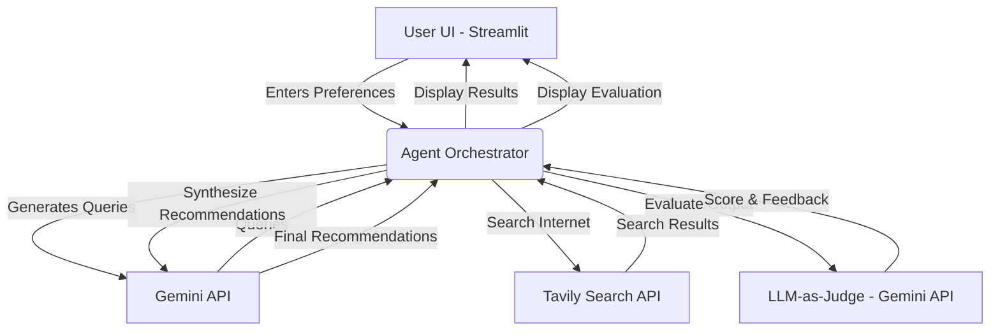

# Book and Course Recommendation Engine

Built for the **Introduction to Agentic AI Systems** End-Semester Project.

This project is an end-to-end deployed AI Agent that takes a user's learning preferences, actively searches the web for the most up-to-date courses and books, synthesizes the results, and self-evaluates its output using an LLM-as-Judge.

## Architecture



## Setup & Local Development

### Requirements
- Python 3.9+
- Gemini API Key
- Tavily API Key

### Installation

1. Clone the repository
2. Install the requirements:
   ```bash
   pip install -r requirements.txt
   ```
3. Run the Streamlit App:
   ```bash
   streamlit run app.py
   ```
4. Enter your API keys into the Streamlit sidebar to test the application.

## Project Structure
- `app.py`: Streamlit frontend application.
- `agent.py`: Core AI Agent logic managing Prompts and Tool usage (Tavily).
- `evaluator.py`: LLM-as-Judge logic with a defined rubric.
- `Task_Decomposition_and_Specs.md`: Documentation on how the agent breaks down the problem.
- `Problem_Statement.md`: Explanation of the problem being solved.

## Deployment
This app is designed to be easily deployed on [Streamlit Community Cloud](https://streamlit.io/cloud) or [Railway](https://railway.app/). Simply connect your GitHub repository and set it to run `streamlit run app.py`.
